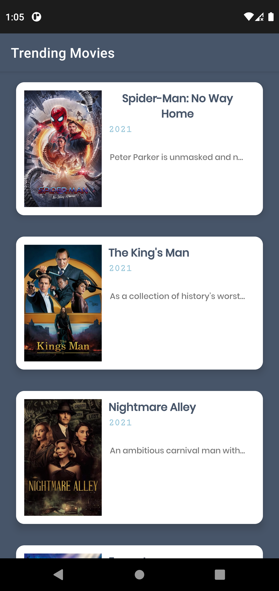
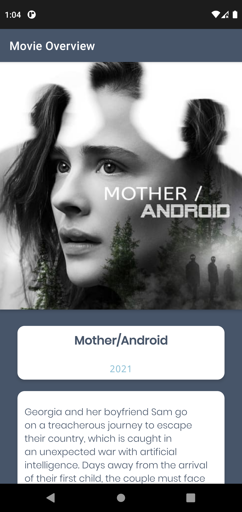
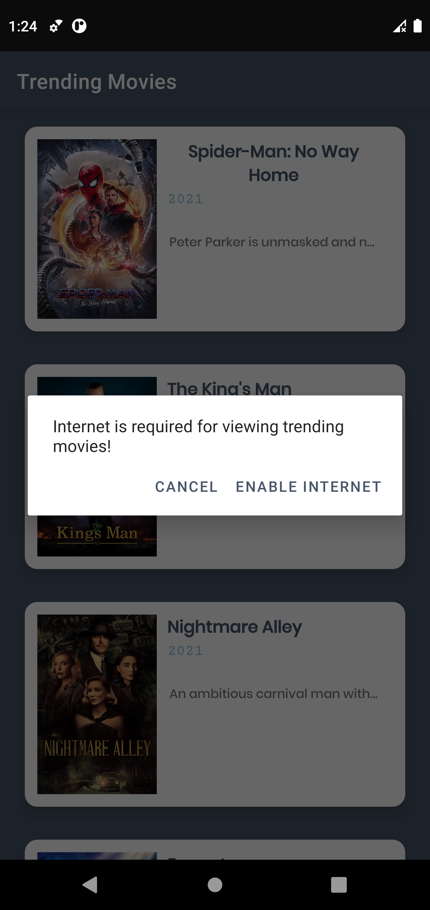

# MoviesApp

## About the project

A native Android app for fetching trending movies from the API Movie DB. 
This app was built using the latest version of Android studio and tested with the latest Android API.

## Screenshots

 
 

## Libraries used

 - Glide
 - Volley
 - RecyclerView
 - Google Guava
 - Google Material

## Privacy concerns

The API key was hidden in a BuildConfig file.

## Features

1. Infinite fetching for trending movies
2. Display in a RecyclerView a list of items composed of title, release year and brief overview
3. Display poster of each movie using the Glide library
4. Pull to refresh fetching
5. Detects if the user is not connected to internet wether via wifi or mobile data
6. Prompts the user to enable internet and redirects them to internet settings
7. Display details about the movie selected from the trending list

## Run this app ?

 1. Clone this repository
 2. Add a file **'apikey.properties'** at the root of the app with two constants: LINK and API_KEY
 3. Go to **File->Sync Project with Gradle files**

